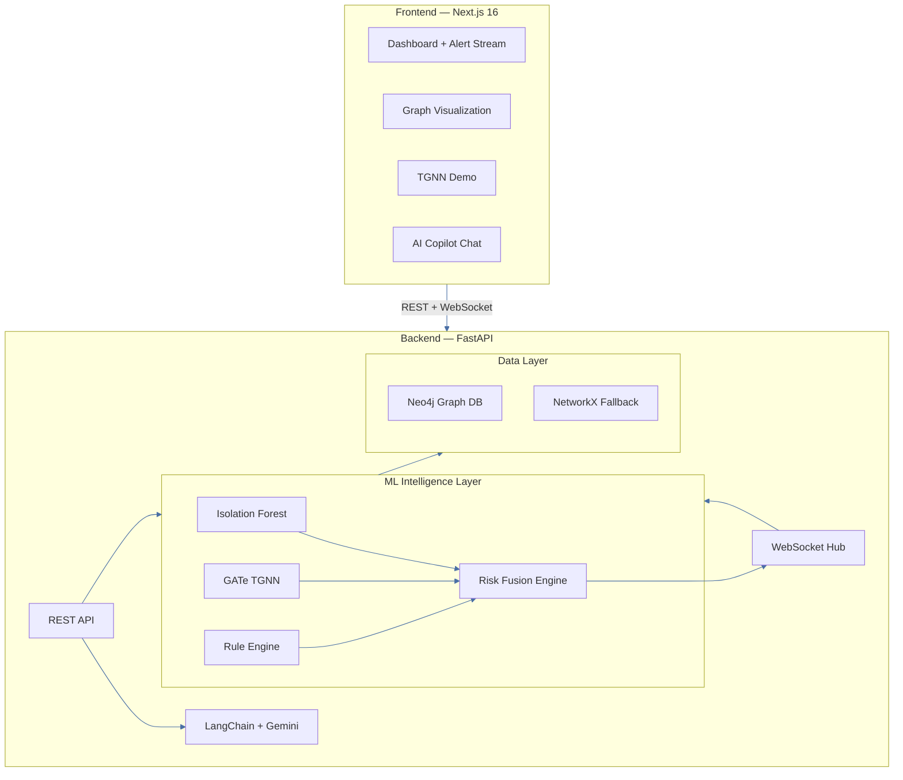
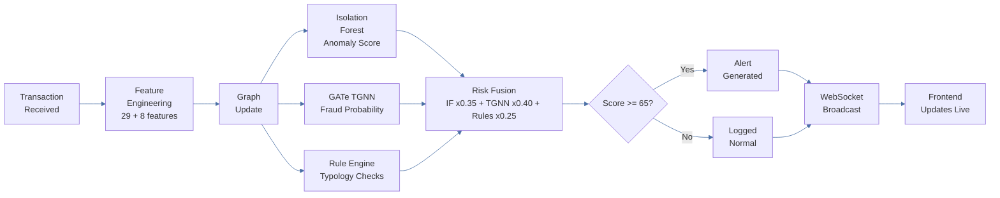
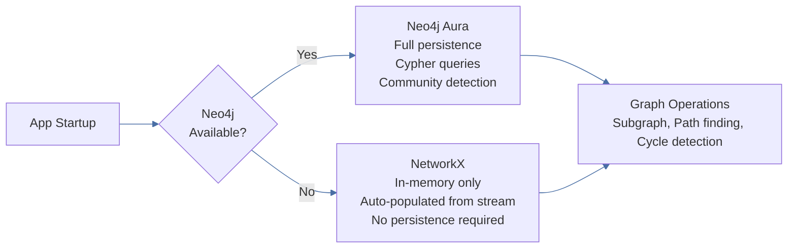

# STAR — Suspicious Transaction Analysis & Response

A real-time Anti-Money Laundering intelligence platform combining Isolation Forest anomaly detection, a Graph Attention Neural Network, a deterministic rule engine, and a Gemini AI Copilot — all fused into a single risk score, streamed live to an interactive frontend.

---

## Table of Contents

- [What is STAR?](#what-is-star)
- [System Architecture](#system-architecture)
- [AI Detection Pipeline](#ai-detection-pipeline)
- [Intelligence Signals](#intelligence-signals)
  - [Isolation Forest](#isolation-forest)
  - [GATe TGNN](#gate-tgnn)
  - [Rule Engine](#rule-engine)
  - [Risk Fusion](#risk-fusion)
- [Graph Store](#graph-store)
- [AI Copilot](#ai-copilot)
- [Tech Stack](#tech-stack)
- [Quick Start](#quick-start)
- [API Reference](#api-reference)
- [Environment Variables](#environment-variables)

---

## What is STAR?

STAR detects financial crime by combining three independent intelligence signals on every transaction:

| Signal | Model | Purpose |
|--------|-------|---------|
| Statistical | Isolation Forest | Behavioral anomaly detection across 29 features |
| Graph | GATe TGNN | Fraud patterns across the transaction network |
| Deterministic | Rule Engine | Classical AML typologies — structuring, layering, fan-out |

All three are weighted and fused into a final 0–100 risk score. Scores above 65 generate alerts broadcast in real time over WebSocket to the dashboard.

---

## System Architecture



---

## AI Detection Pipeline

Every transaction flows through the full pipeline before a final decision is made:



---

## Intelligence Signals

### Isolation Forest

The Isolation Forest is a trained anomaly detection model. Rather than learning a profile of fraud, it learns to *isolate* rare data points. Fraudulent transactions are structurally unusual — they require fewer splits in a decision tree to isolate than normal ones. Short path = high anomaly score.

**Input:** 29 features including transaction amount, time-of-day, velocity metrics, currency encoding, and historical account behavior.

**Artifacts:**
- `isolation_models/isolation_forest.pkl` — trained model
- `isolation_models/scaler.pkl` — StandardScaler normalization
- `isolation_models/model_metadata.pkl` — threshold, ROC-AUC, PR-AUC

---

### GATe TGNN

GATe (Graph ATtention network with edge features) is a deep learning model trained on the IBM AML Medium_HI dataset on an NVIDIA H200. It operates on the full transaction graph — not just individual transactions — so it can detect laundering patterns that span multiple hops and accounts.

**How it works:**
1. Each account is a node; each transaction is a directed edge with 8 features
2. GATe applies multi-head attention across neighbors to learn which relationships signal fraud
3. It outputs a per-edge fraud probability (0–1), precomputed at startup for the demo scenario

**Architecture:** 2 x GATConv layers, 4 attention heads, 64 hidden dimensions, 8-dim edge features

**Artifacts:**
- `inference_data/checkpoint_gat_medium_hi.tar` — trained weights
- `inference_data/node_norm_stats_medium_hi.pt` — node Z-normalization stats
- `inference_data/edge_norm_stats_medium_hi.pt` — edge Z-normalization stats

---

### Rule Engine

The Rule Engine applies 7 deterministic AML typologies. Every triggered rule produces a human-readable explanation attached to the alert, making the system fully auditable for compliance teams.

| Rule | Trigger Condition | Severity |
|------|-------------------|----------|
| Structuring | 3+ transactions between $8k–$10k within 24h | High |
| Fan-Out | 8+ unique receivers from one sender in 1 hour | High |
| Rapid Layering | 4+ hops in under 30 minutes | Critical |
| Dormant Reactivation | 90+ days inactive, then transfer over $10k | Medium |
| Round-Trip | Funds return to origin account within 24h | Critical |
| Velocity Breach | Transaction rate exceeds 3x historical baseline | Medium |
| High-Value Transfer | Single transfer exceeding $100,000 | High |

**Severity contribution to rule score:** Low +5, Medium +15, High +25, Critical +40

---

### Risk Fusion

The Risk Fusion Engine combines the three signals using a weighted linear formula:

```
final_score = (0.35 x IF_score) + (0.40 x TGNN_score) + (0.25 x Rule_score)
```


TGNN holds the highest weight because graph-based patterns catch sophisticated layering schemes that behavioral models miss in isolation.

**Risk levels:**

| Score | Level |
|-------|-------|
| 0–29 | Normal |
| 30–44 | Monitoring |
| 45–59 | Moderate |
| 60–74 | High |
| 75–100 | Critical |

---

## Graph Store

STAR maintains a live transaction graph and automatically falls back to in-memory mode if Neo4j is unavailable:



Graph schema uses `(Person)-[:TRANSACT]->(Person)` edges with transaction metadata, and `(Alert)-[:FLAGGED_BY]->(Person)` for case management.

---

## AI Copilot

The STAR Copilot is an AML-specialized conversational assistant built on LangChain and Google Gemini 2.5 Flash. It has been given a 15-year AML investigator persona and has access to live graph data, risk scores, and pattern detection results.

Capabilities:
- Multi-turn conversation with 10-turn session memory
- SAR (Suspicious Activity Report) narrative drafting
- Risk score breakdown explanation with regulatory context
- Graph traversal explanations and investigation suggestions

---

## Tech Stack

| Layer | Technology |
|-------|-----------|
| Frontend | Next.js 16, React 19 |
| Animations | Framer Motion, GSAP |
| Graph Visualization | Three.js, react-force-graph-2d |
| Backend | FastAPI, Uvicorn |
| Anomaly Detection | Isolation Forest — scikit-learn |
| Graph Neural Network | GATe — PyTorch + PyTorch Geometric |
| Graph Store | Neo4j Aura, NetworkX fallback |
| AI Copilot | LangChain + Google Gemini 2.5 Flash |
| Package Manager | uv (Python), npm (Node.js) |

---

## Quick Start

### Prerequisites

- Python 3.12+ with `uv`
- Node.js 18+ and npm

### Backend

```bash
cd backend

# Install dependencies
uv sync

# Install PyTorch (CPU build recommended for local dev)
uv pip install torch --index-url https://download.pytorch.org/whl/cpu
uv pip install torch-geometric -f https://data.pyg.org/whl/torch-2.2.0+cpu.html

# Set Gemini API key for Copilot (optional)
# Edit backend/.env → GEMINI_API_KEY=your_key

# Start server
uv run python -m app.main
```

Backend: `http://localhost:8000` | Swagger UI: `http://localhost:8000/docs`

### Frontend

```bash
# In a new terminal tab
cd apps/web

npm install
npm run dev
```

Frontend: `http://localhost:3000`

### Demo

Navigate to `http://localhost:3000/tgnn` and click **Start Demo**. The system streams 308 IBM AML transactions through the full pipeline, building the force-graph live and firing alerts as fraud patterns emerge.

Neo4j is optional — the system automatically falls back to an in-memory graph with full functionality.

---

## API Reference

### System

| Method | Endpoint | Description |
|--------|----------|-------------|
| GET | `/system/health` | Status of all services |
| GET | `/system/models` | Model metadata and thresholds |

### Scoring

| Method | Endpoint | Description |
|--------|----------|-------------|
| POST | `/score/transaction` | Full pipeline score — IF + TGNN + Rules fused |
| POST | `/score/account` | Account behavioral anomaly score |
| POST | `/score/graph` | Batch graph inference |

### Alerts

| Method | Endpoint | Description |
|--------|----------|-------------|
| GET | `/alerts` | Retrieve alerts, filterable by status and risk level |
| PATCH | `/alerts/{id}` | Update alert status — approve, reject, or escalate |

### Inference (TGNN Demo)

| Method | Endpoint | Description |
|--------|----------|-------------|
| GET | `/api/graph` | Initial graph nodes and links for visualization |
| GET | `/api/cases` | Active pending review cases |
| POST | `/api/cases/{id}/review` | Submit a case decision |

### Copilot

| Method | Endpoint | Description |
|--------|----------|-------------|
| POST | `/copilot/query/sync` | Synchronous investigation query |
| POST | `/copilot/query` | Streaming response via SSE |
| POST | `/copilot/sar` | Generate a SAR narrative |

### WebSockets

| Endpoint | Description |
|----------|-------------|
| `ws://localhost:8000/ws/stream` | Global real-time transaction and alert stream |
| `ws://localhost:8000/ws/inference?threshold=0.35` | On-demand TGNN inference demo stream |

---

## Environment Variables

| Variable | Default | Description |
|----------|---------|-------------|
| `GEMINI_API_KEY` | — | Google AI key, required for Copilot |
| `GEMINI_MODEL` | `gemini-2.0-flash` | Gemini model version |
| `NEO4J_URI` | `bolt://localhost:7687` | Neo4j connection URI |
| `NEO4J_USER` | `neo4j` | Neo4j username |
| `NEO4J_PASSWORD` | `password` | Neo4j password |
| `PORT` | `8000` | Backend port |
| `RISK_ALERT_THRESHOLD` | `65.0` | Score threshold to generate an alert |
| `IF_WEIGHT` | `0.35` | Isolation Forest weight |
| `TGNN_WEIGHT` | `0.40` | TGNN weight |
| `RULE_WEIGHT` | `0.25` | Rule engine weight |
| `STREAM_INTERVAL_MS` | `2000` | Milliseconds between streamed transactions |

---

Internal POC — STAR Platform. IBM AML Synthetic Dataset used for research and demonstration.
